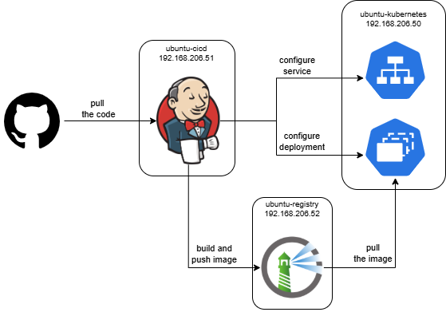

# End-to-End CI/CD Pipeline

This repository contains the complete setup for a CI/CD pipeline that automatically builds and deploys a containerized React application to a Kubernetes cluster. 

## Tech Stack

* **CI/CD:** Jenkins
* **Orchestration:** K3s
* **Application:** React JS
* **Containerization:** Docker
* **Container Registry:** Harbor
* **Infrastructure:** VM on VMware Workstation

## Architecture Diagram

* exp 1 
* exp 2

## The CI/CD Workflow

* Jenkins pulls the latest source code from the GitHub repository
* Jenkins uses the `Dockerfile` to build a new version-tagged Docker image of the React application 
* The image tag is automatically incremented using the Jenkins build number
* The newly built image is pushed to a private Harbor registry
* Jenkins uses `kubectl` to apply the Kubernetes `deployment.yaml`
  * It first updates the `deployment.yaml` to use the new image tag
  * `kubectl apply` to both `deployment.yaml` and `service.yaml`
* The Jenkins agent cleans up the local Docker image to conserve disk space

<!-- ## How to Run This Project

1.  **Prerequisites:**
    * Three Ubuntu Server VMs (for Jenkins, Harbor, and K3s).
    * Jenkins, Docker, Harbor, and K3s installed and configured.
2.  **Configuration:**
    * Store your Harbor and K3s credentials securely in the Jenkins Credentials Manager.
    * Update the repository URL in the Jenkins job configuration.
3.  **Run:**
    * Trigger the pipeline manually or by pushing a change to the GitHub repository. -->